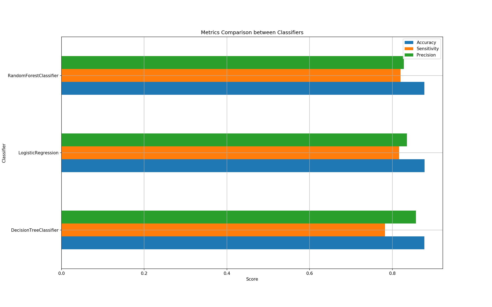

# Loan Default Predriction

## Overview
The goal was to build a predictive model that assigns default probabilities to loan applications. 

**Optimization:** It was assumed that Anyfin cares more about accurately predicting defaulters rather than non-defaulters. Therefore, the predictive model was optimized for sensitivity (recall).

## Approach
In order to tackle this problem, the dataset provided was used to train a classification model. I began by doing some exploratory data analysis on the entire dataset in order to better understand it's features. Then, I cleaned the data to prepare it for the model building step. During the model building step, the data was transformed to get it ready for training. I trained several classification models and then compared them to each other using accuracy, sensitivity and precision scores. Here is more information on how model selection was approached:

### Model Selection

First, five different classification models were compared to each other using accuracy, sensitivity, and precision scores. No hyperparameter tuning was performed on this step since it is computationally costly and the goal was to first identify poor performing models to exclude. Here are the results:

**Observations:** Since the goal is to optimize for sensitivity (more accurately predict defaults), it seems like the best algorithm would be the SVC. The problem is that it has a very low precision score, which means that it won't do a good job generalizing to new data. On the other hand, Random Forest Classifier has a high sensitivity and an even higher precision score, and since both scores are inversely related, improving the sensitivity will still leave us with a decent precision score, giving us a better model overall.

Based on my previous analysis, I decided to only focus on the top three classifiers. This time, I did some basic hyperparameter tuning and used the best hyperparameters to retrain the models and compare them to each other. Here are the results:

**Observations:** As we can see, all three models performed similarly, but I will choose Random Forest Classifier for the final model.

More information about the different techniques used during the model selection process:

* **Over-sampling:** The SMOTE technique was used to over-sample to data since no-default was the majority class.
* **Model Validation:** Since our dataset is fairly small, Cross-validation (K-Fold) was used as opposed to hold-out validation in order to get a more accurate validation.
* **Feature Selection:** No feature selection, aside from dropping some columns during the data cleaning step, was performed. This step was excluded for time saving purposes. Recursive Feature Elimination could've been used.
* **Hyperparameter Tuning:** Grid Search Cross Validation was used to fine tune the hyperparameters for each of the top classification models. This method was used as opposed to Bayesian Optimization since it is the easiest to implement. 

More details can be found on the `1-Data-Cleaning-And-EDA.ipynb` and `2-Model-Building.ipynb` notebooks.

## Final Model

The final classification model selected was Random Forest Classifier. 

* Accuracy: 0.882318
* Sensitivity: 0.823843
* Precision: 0.836784

It was retrained on the entire dataset (not just training data) and then saved as `loan_default_predictor.pkl` (pickle file) for later use.

### Ways to further improve the model:
* **More Data:** Our dataset was fairly small (12000 data points) and more data could help improve the accuracy of our model.
* **Feature Selection:** Applying a technique such as RFE could help us minimize the number of features needed for training and help us improve the overall accuracy.
* **More Hyperparameter tuning:** More parameter combinations could be used as part of Grid Search or perhaps a non brute force approach such as Bayesian Optimization.  
* **Adjust Threshold:** We can plot an ROC curve to help us choose a classification threshold that balances sensitivity and specificity in a way that makes for the business purpose.
